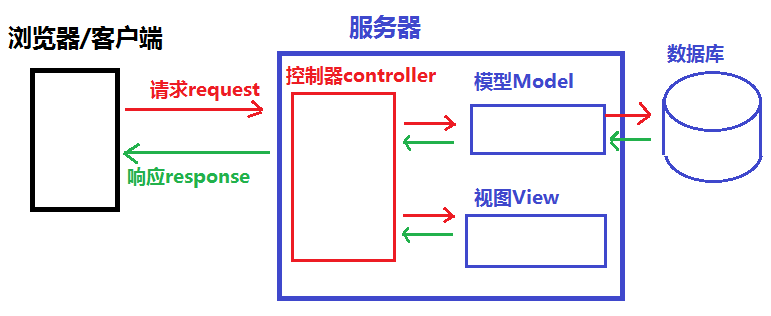
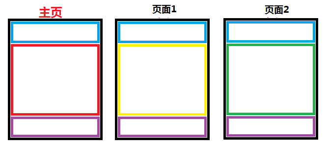

# 《Django Web框架教学笔记》
## 目录
[TOC]

## Django的框架设计模式
- MVC 设计模式
    - MVC 代表 Model-View-Controller（模型-视图-控制器） 模式。
    - 作用: 降低模块间的耦合度(解耦)
    - MVC
        - M 模型层(Model), 主要用于对数据库层的封装
        - V 视图层(View), 用于向用户展示结果
        - C 控制(Controller ，用于处理请求、获取数据、返回结果(重要)
    - MVC模式如图:
        
- MTV 模式
    MTV 代表 Model-Template-View（模型-模板-视图） 模式。这种模式用于应用程序的分层开发
    - 作用: 
        - 降低模块间的耦合度(解耦)
    - MTV 
        - M -- 模型层(Model)  负责与数据库交互
        - T -- 模板层(Template)  负责呈现内容到浏览器
        - V -- 视图层(View)  是核心，负责接收请求、获取数据、返回结果
    - MTV模式如图:
        

## 模板 Templates
- 什么是模板
    1. 模板是可以根据字典数据动态变化的html网页
    2. 模板可以根据视图中传递的字典数据动态生成相应的HTML网页。

- 模板的配置
    - 创建模板文件夹`<项目名>/templates`
    - 在 settings.py 中 TEMPLATES 配置项
        1. BACKEND : 指定模板的引擎
        2. DIRS : 模板的搜索目录(可以是一个或多个)
        3. APP_DIRS : 是否要在应用中的 `templates` 文件夹中搜索模板文件
        4. OPTIONS : 有关模板的选项

- 默认的模块文件夹`templates`
- 修改settings.py文件，设置TEMPLATES的DIRS值为`'DIRS': [os.path.join(BASE_DIR, 'templates')],`
```python
# file: settings.py
TEMPLATES = [
    {
        'BACKEND': 'django.template.backends.django.DjangoTemplates',
        # 'DIRS': [],
        'DIRS': [os.path.join(BASE_DIR, 'templates')],  # 添加模板路径
        'APP_DIRS': True,  # 是否索引各app里的templates目录
        ...
    },
]
```

3. 模板的加载方式
    1. 通过 loader 获取模板,通过HttpResponse进行响应
        ```python
        from django.template import loader
        # 1.通过loader加载模板
        t = loader.get_template("模板文件名")
        # 2.将t转换成 HTML 字符串
        html = t.render(字典数据)
        # 3.用响应对象将转换的字符串内容返回给浏览器
        return HttpResponse(html)
        ```
        
    2. 使用 render() 直接加载并响应模板,用的更多（数据字典用local()更加好一点）
       
        ```python
        from django.shortcuts import render
        return render(request,'模板文件名', 字典数据)
        ```

###  Django 模板语言

#### 模板的传参
- 模板传参是指把数据形成字典，传参给模板，为模板渲染提供数据
1. 使用 loader 加载模板
    ```python
    t = loader.get_template('xxx.html')
    html = t.render(字典数据)
    return HttpResponse(html)
    ```
2. 使用render加载模板
    ```python
    return render(request,'xxx.html',字典数据)
    ```

#### 模板的变量
1. 在模板中使用变量语法
    - `{{ 变量名 }}`
    
    - `{{ 变量名.index }}`
    
    - `{{ 变量名.key}}`

    - `{{ 对象.方法 }}`
    
    - `{{ 函数名 }}`
    
      

2.视图函数中必须将变量封装到字典中才允许传递到模板上

```python
def xxx_view(request)
    dic = {
        "变量1":"值1",
        "变量2":"值2",
    }
    return render(request, 'xxx.html', dic)
```

3. 如果变量过多，可以使用 locals() 将局部变量自动生成字典，**最常用**

```python
def xxx_view(request)
	变量1 = 值1
    变量2 = 值2
    ...
    return render(request, 'xxx.html', locals())
```


#### XSS攻击

定义：XSS全称是Cross Site Scripting即跨站脚本

原理：将恶意HTML/JavaScript代码注入到受害用户浏览的网页上，从而达到攻击目的

危害：盗取用户信息，破坏网站正常运行等

分类：

##### 	反射型xss

​    定义：发出请求时，XSS代码出现在URL中，作为输入提交到服务器端，服务器端解析后响应，XSS代码随响应内容一起传回给浏览器，最后浏览器解析执行XSS代码。这个过程像一次反射，故叫反射型XSS

```shell
样例：
以查询字符串形式提交 xss代码
http://127.0.0.1:8000/test_html?t=<script>alert(11)</script>
后端接到查询字符串的值后，显示在页面中
```

##### 	存储型xss

​	定义：提交的XSS代码会存储在服务器端（数据库，内存，文件系统等），其他用户请求目标页面时即被攻击

```shell
样例：
    博客发表文章时，提交XSS代码，服务器存储代码后，其他用户访问该文章时，被XSS攻击
```

##### 	DOM xss

​	定义：DOM XSS的代码无需跟服务器交互，在前端直接触发攻击

```js
样例：
地址栏提交#内容，例如-http://127.0.0.1:8000/test_html#javascript:alert(11)

页面中添加JS:
<script>
    var hash = location.hash;
    if(hash){
        var url = hash.substring(1);
        location.href = url;
    }
</script>
```


#### 模板的标签

文档可参见：https://docs.djangoproject.com/en/2.2/ref/templates/builtins/#built-in-tag-reference

1. 作用
   
    - 将一些服务器端的功能嵌入到模板中
    
2. 标签语法
    ```
    
    ...
    
    ```
    
3. if 标签
    ```
    
    ...
    
    ...
    
    ...
    
    ...
    
    ```
    
4. if 标签里的布尔运算符
   
    - if 条件表达式里可以用的运算符 ==, !=, <, >, <=, >=, in, not in, is, is not, not、and、or             
    - **上面的不能使用小括号**
    - 在if标记中使用实际括号是无效的语法。 如果您需要它们指示优先级，则应使用嵌套的if标记。
    
    
    
    练习
    
    - 写一个简单的计算器页面，能够在服务端进行简单加减乘除计算
    
      <form action='/mycal' method='POST'>
          <input type='text' name="x" value="1">
          <select>
              <option value="add"> +加 </option>
              <option value="sub"> -减 </option>
              <option value="mul"> *乘 </option>
              <option value="div"> /除 </option>
          </select>
          <input type='text' name="y" value="2"> = <span>3</span>
          <div>
              <input type="submit" value='开始计算'>
          <div>
      </form>
    
    - 参考代码
    
    ```html
    <form action='/mycal' method='POST'>
        <input type='text' name="x" value="1">
        <select name='op'>
            <option value="add"> +加 </option>
            <option value="sub"> -减 </option>
            <option value="mul"> *乘 </option>
            <option value="div"> /除 </option>
        </select>
        <input type='text' name="y" value="2"> = <span>3</span>
        <div>
            <input type="submit" value='开始计算'>
        </div>
    </form>
    ```
    
    
    
6. for 标签
    1. 语法
        ```
        
            ... 循环语句
        
            ... 可迭代对象无数据时填充的语句
        
        ```
    2. 内置变量 - forloop
        | 变量 | 描述 |
        |:-:|:-:|
        | forloop.counter | 循环的当前迭代（从1开始索引） |
        | forloop.counter0 | 循环的当前迭代（从0开始索引） |
        | forloop.revcounter | counter值得倒序 |
        | forloop.revcounter0 | counter0值的倒序 |
        | forloop.first | 如果这是第一次通过循环，则为真 |
        | forloop.last | 如果这是最后一次循环，则为真 |
        | forloop.parentloop | 当嵌套循环，parentloop 表示外层循环 |


#### 过滤器
1. 作用
    - 在变量输出时对变量的值进行处理
    - 可以通过使用 过滤器来改变变量的输出显示。
2. 语法
   
    - {{ 变量|过滤器1:参数值1|过滤器2:参数值2 ... }}
3. 常用的过滤器
    | 过滤器 | 说明 |
    |:-:|:-:|
    | lower | 将字符串转换为全部小写。|
    | upper | 将字符串转换为大写形式 |
    | safe | 默认不对变量内的字符串进行html转义，**django有的时候会任务html操作是不安全的所以要加safe** |
    | add: "n" | 将value的值增加 n |
    | truncatechars:'n' | 如果字符串字符多于指定的字符数量，那么会被截断。 截断的字符串将以可翻译的省略号序列（“...”）结尾。 |
    | ... | |

5. 文档参见:
   
    - <https://docs.djangoproject.com/en/2.2/ref/templates/builtins/#built-in-filter-reference>

### 模板的继承

作用：复用，子模板可以使用父模板的内容

- 模板继承可以使父模板的内容重用,子模板直接继承父模板的全部内容并可以覆盖父模板中相应的块
- 定义父模板中的块 `block`标签
    - 标识出哪些在子模块中是允许被修改的
    - block标签：在父模板中定义，可以在子模板中覆盖
        ```
        
        定义模板块，此模板块可以被子模板重新定义的同名块覆盖
        
        ```
- 继承模板 `extends` 标签(写在模板文件的第一行)
    - 子模板继承语法标签
        - ``
        - 如:
            - ``
    - 子模板 重写父模板中的内容块
    ```
    
    子模板块用来覆盖父模板中 block_name 块的内容
    
    ```
    - 重写的覆盖规则
        - 不重写,将按照父模板的效果显示
        - 重写,则按照重写效果显示
    - 注意
        - 模板继承时,服务器端的动态内容无法继承

- 参考文档
  
- <https://docs.djangoproject.com/en/2.2/ref/templates/language/#for-template-blocks>
  
- 模板的继承示例:
  
    - 

### url 反向解析
- url 反向解析是指在视图或模板中，用path定义的名称来查找或计算出相应的路由

- path 函数的语法
    - path (route, views, name="别名")
    - 例如:
        - path('page', views.page_view, name="page_url")

- path() 的`name`关键字参数
    - 作用:
      
        - 根据path中的`name=`关键字传参给 url确定了个唯一确定的名字，在模板或视图中，可以通过这个名字反向推断出此url信息
        
    - 在模板中 ->通过url标签实现地址的反向解析
      
        ```python
        
        
        ex:
        
        
        ```
        
    - 在视图函数中 ->可调用 django中的 reverse 方法进行反向解析
      
        ```python
        from django.urls import reverse
        reverse('别名', args=[], kwargs={})
        ex:
        print(reverse('pagen',args=[300]))
        print(reverse('person',kwargs={'name':'xixi','age':18}))
        ```
    
       **同名找最合适的【参数一致的】；参数一致时，找最后一个；**
    
- 练习:
  
    ```
    写一个有四个自定义页面的网站，对应路由:
    /       主页
    /page1   页面1
    /page2   页面2
    /page3   页面3
    功能: 主页加 三个页面的连接分别跳转到一个 页面，三个页面每个页面加入一个链接用于返回主页
    ```

